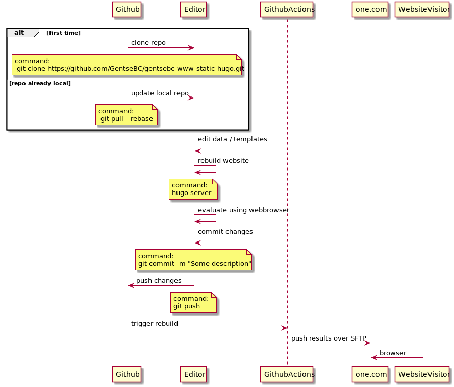

# Gentse BC website

This repo contains
* content & templates to build the static [website of the Gentse BC](https://www.gentsebc.be)

## Edit process
### For bigger changes requiring local review
Required tools:
* [git](https://git-scm.com/downloads): version controlling system
* [hugo](https://gohugo.io/getting-started/installing/): static site generator

### For smaller changes requiring no local review
Edit and commit directly on Github. A rebuild & push to one.com will be triggered automatically.
Review if the build is not failing in [Github Actions](https://github.com/GentseBC/gentsebc-www-static-hugo/actions/workflows/build-and-deploy.yml) 