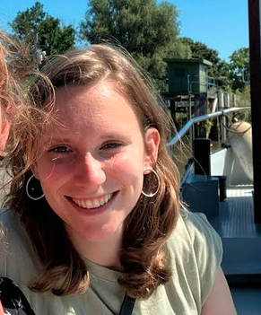

Als badmintonclub proberen we een verschil te maken op vlak van integriteit en inclusie. Dit doen we oa. door een warme, sympathiekste en veilige community te creëren. We hebben daarom sinds begin 2020 API's in de club. 

## Aanspreekpersoon integriteit (API)
De club-API is de persoon waarbij iedereen (spelers, ouders, begeleiders, andere betrokkenen) terecht kan met een vraag, vermoeden of klacht over grensoverschrijdend gedrag of lichamelijke en seksuele integriteit. Heb je een vraag, opmerking, klacht of andere boodschap en wil je hier met iemand over spreken? 

Onze speelster Elena is opgeleid als API en neemt deze taak op zich. 
Als sporter, ouder, trainer, bestuurder of andere vrijwilliger van onze badmintonclub kan je bij Elena terecht met een vraag, vermoeden of klacht over psychisch, fysiek of seksueel grensoverschrijdend gedrag.
De club-API zal in alle discretie luisteren naar je vraag of verhaal en advies verlenen bij de mogelijke vervolgstappen. Indien nodig zal ze jou doorverwijzen.
Iedereen moet zich veilig voelen in de omgeving waar hij/ zij sport. Is dat niet meer het geval, aarzel dan niet om Elena te contacteren. Je haar mij steeds bereiken per sms/telefoon (0472/42.68.74) of mail (elena_kuypers@hotmail.com). Je kan zelf kiezen bij welk communicatiemiddel je jou het best voelt.
  
    

👉 Elena