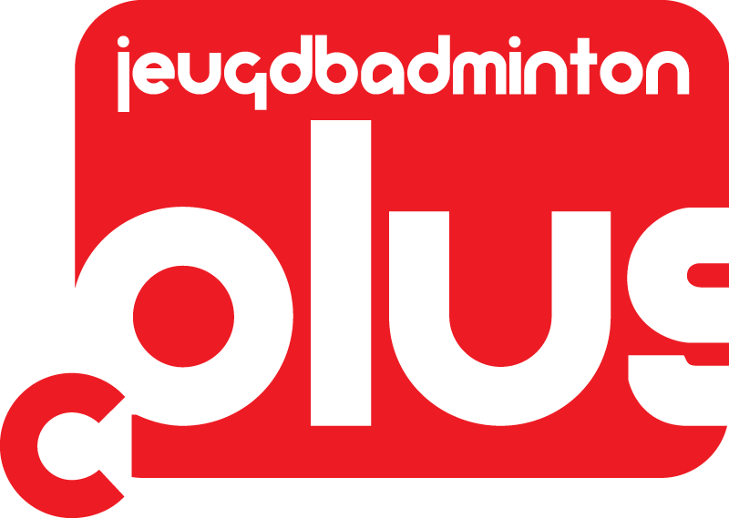
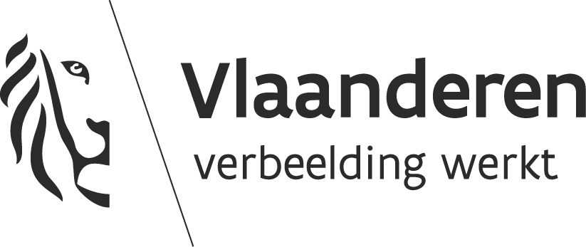

# Gentse BC verdient kwaliteitslabel C+ voor zijn jeugdwerking  
Onze club heeft met trots het Jeugdbadminton C+ label behaald!   

 

Jeugdbadminton+ is een project van Badminton Vlaanderen met steun van de Vlaamse Gemeenschap. 
Dit jeugdsportfonds focust zich op  Vlaamse badmintonclubs om hun initiatieven te ontplooien die hun jeugdwerking kwalitatief verbeteren, in  het bijzonder aan de kwalitatieve verbetering ervan. 
Wil je meer weten over alle facetten van dit label? Verdere info vind je op de site van badmintonplus https://www.jeugdbadmintonplus.be/.

