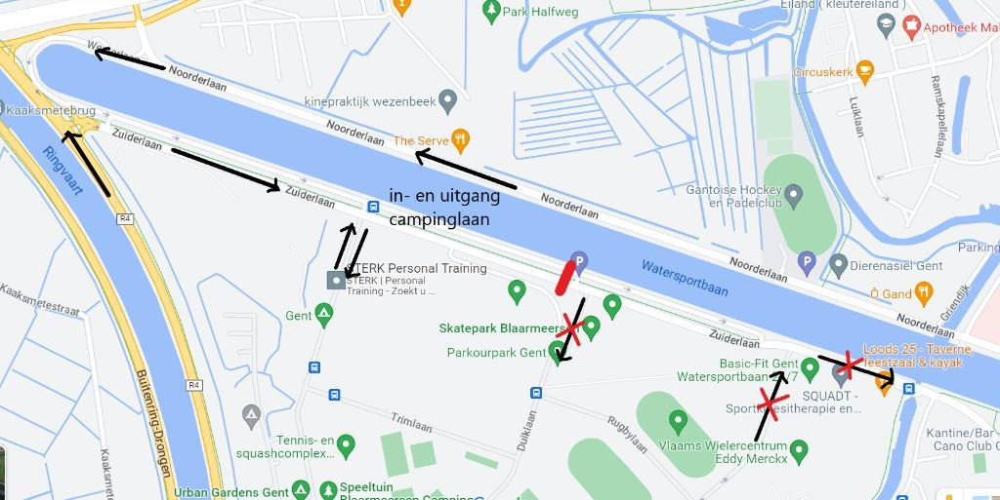

BELANGRIJK VOOR WIE MET DE AUTO NAAR DE BLAARMEERSEN KOMT…

De bouw van de brug over de Watersportbaan zorgt voor hinder voor het bereiken van de Blaarmeersen.

--> het kruispunt van de Zuiderlaan met de Strandlaan wordt afgesloten voor gemotoriseerd verkeer, met uitzondering van openbaar vervoer, hulpdiensten en werfverkeer in beide richtingen.
Aanrijden en wegrijden via het kruispunt aan de Strandlaan kan dus niet meer. Om de Blaarmeersen te bereiken moeten jullie omrijden via de Noorderlaan of de R4 en is de inggang de Campinglaan (de vroegere uitgang). 
Wegrijden vanaf de P&R Watersportbaan (en de Blaarmeersen) gebeurt via Parking Oost (strandlaan), en dus de normale uitgang.
Bij de uitgang zal enkel verkeer richting R4 mogelijk zijn en niet richting Basic Fit en rondpunt watersportbaan.
De hinder zal nog tot aan de kerstvakantie aanhouden. 

💡 Zie stratenplan ter verduidelijking.

